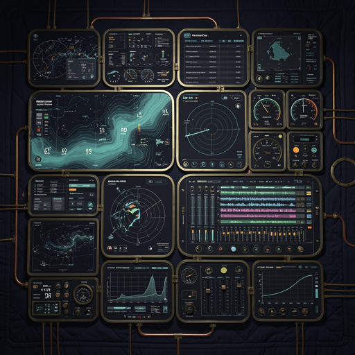

# ◳ quilt-cell-bridges

<p align="center">
  
</p>

> **Port the 300-repo SuperInstance ecosystem to Quilt cells. One file, three openers.**

[](LICENSE)
[](https://python.org)
[](docs/bridge-catalog.md)
[](docs/architecture.md)
[](https://github.com/SuperInstance/quilt)

**[Discovery page ⚡](https://superinstance.dev/cell-bridges.html)** · **[3-View Studio](https://superinstance.dev/three-view-studio.html?load=vessel)** · **[Architecture →](docs/architecture.md)** · **[Bridge catalog →](docs/bridge-catalog.md)**

---

## What this is

The SuperInstance org is 300+ repos, and most of them were built **before Quilt existed** — but they were already expressing the cell model, each in its own dialect. A vessel-agent-system's digital twin is a graph of cells. A chart-room's four panels are four views of the same cells. A slackwater-tminus's coordination primitives are temporal cells. The cell was always the water under the fleet; it just hadn't been named yet.

This repo is the **bridgehead** — the migration story of the whole ecosystem into the cell model. Every bridge here reads one of those pre-Quilt systems (or one of its families) and re-emits it as a `.qzt` cell graph: 3D space plus time, rendered three ways by 3-View Studio. Fifty bridges are live, covering the vessel, chart-room, slackwater, and hermes families and dozens more. The systems aren't being rewritten — they're being **ported**, hull by hull, into the grid they were always sailing on.

## What is a cell bridge

A **bridge** is a small, single-purpose Python script: `vessel_to_quilt.py`, `chart_room_to_quilt.py`, `hermes_home_to_quilt.py` — one source system, one target format. It follows a clean pattern:

1. **Read** the source system — its real data model where one exists (repos with a clean schema), a family's repo list for the family bridges, or a faithful synthetic model where the system has no live API yet.
2. **Map** its parts onto cells — every state variable, panel, room, primitive, or timeline event becomes a cell with a stable path (`vessel.rpm`, `truth.position`, `soul.name`).
3. **Write** a `.qzt` file — a single JSON document holding the whole cell graph: cells, edges, metadata, stats. One file, portable, renderable, loadable.

The output is a **4D cell graph** (3D space + time). The same file, opened three ways:

| View | What it renders | Instrument it evokes |
|------|----------------|----------------------|
| **TOP** (spatial) | positions, bathymetry, rooms, topology | openCPN-style chart |
| **FRONT** (signals) | live state, panels, sensor readings | TimeZero-style engineering console |
| **SIDE** (time) | timelines, coordination, history | DAW-style track timeline |

Same data. Three openers. One file. See [docs/architecture.md](docs/architecture.md) for the full rendering contract and the cell/bridge/ecosystem scale views.

## Quickstart

```bash
# Clone
git clone git@github.com:SuperInstance/quilt-cell-bridges.git
cd quilt-cell-bridges

# Generate a .qzt file for any bridge (here: the vessel's digital twin)
python3 vessel_to_quilt.py --out /tmp/eileen --duration-min 30
# → /tmp/eileen/vessel.qzt  (188 cells, 4D: space + 30 min of time)

# Open the discovery page — pick a system, see it as cells
# https://superinstance.dev/cell-bridges.html

# Or load a bridge straight into 3-View Studio
# https://superinstance.dev/three-view-studio.html?load=vessel
```

**What's a `.qzt`?** A Quilt Zip Target — the portable cell-graph format every bridge emits. It's plain JSON with a `version`, a `kind` of `quilt-zip-target`, a `name` and `description`, the `cells` and `edges` of the graph, `external_refs` back to the source material, and `stats` (cell/edge counts). 3-View Studio reads it directly; the discovery page lists them all.

## Bridges (live)

The original seven, straight from the fleet's core:

| Source repo | What it does | Quilt bridge | Cells |
|---|---|---|---|
| [vessel-agent-system](https://github.com/SuperInstance/vessel-agent-system) | F/V EILEEN's digital twin | `vessel_to_quilt.py` | 188 |
| [chart-room](https://github.com/SuperInstance/chart-room) | Four panels, one truth | `chart_room_to_quilt.py` | 144 |
| [slackwater-tminus](https://github.com/SuperInstance/slackwater-tminus) | Temporal coordination | `slackwater_tminus_to_quilt.py` | 54 |
| [hermes-home](https://github.com/SuperInstance/hermes-home) | Hermes's runtime home | `hermes_home_to_quilt.py` | 83 |
| [spatial-registry](https://github.com/SuperInstance/spatial-registry) | 4 worlds, 33 rooms, 6 cross-world portals | `spatial_registry_to_quilt.py` | 762 |
| [grand-pattern-rs](https://github.com/SuperInstance/grand-pattern-rs) | Fibonacci dual-direction architecture (12 ports) | `grand_pattern_to_quilt.py` | 412 |
| [spline-spectral](https://github.com/SuperInstance/spline-spectral) | B-splines as spectral objects | `spline_spectral_to_quilt.py` | 299 |

**50 bridges are live in total** — the seven above plus family bridges that port whole cohorts of repos (the `agent-*` family: 81 repos; `cocapn-*`: 77; `conservation-*`: 60; `constraint-*`: 47; and more), plus single-system ports like `wesley_to_quilt.py`, `othismos_reef_to_quilt.py`, `colony_cell_to_quilt.py`, and `quilt_ai_to_quilt.py`. Every one, catalogued with its source family and purpose, lives in **[docs/bridge-catalog.md](docs/bridge-catalog.md)**.

## Directory map

```
quilt-cell-bridges/
├── assets/
│   └── hero.jpg                     # the quilt, viewed from above
├── docs/
│   ├── architecture.md              # the .qzt format, cell anatomy, 3-views contract
│   └── bridge-catalog.md            # all 50 bridges, by family
├── *_to_quilt.py                    # the bridges themselves
└── *.qzt                            # emitted cell graphs (17 checked in)
```

**The families, at a glance:**

| Family | Bridges | What gets ported |
|---|---|---|
| **vessel** | `vessel_to_quilt.py`, `vessel_runtime_family_to_quilt.py` | F/V EILEEN's twin; hardware abstraction, bytecode VM, N-body sim, maritime networking |
| **chart-room** | `chart_room_to_quilt.py` | Four panels, one truth — nav / engineering / tactical / sonar from a single TruthCell |
| **slackwater** (temporal) | `slackwater_tminus_to_quilt.py`, `temporal_heartbeat_to_quilt.py` | Time-shaped coordination: deadlines, BPM clocks, cron, heartbeats as temporal cells |
| **hermes** | `hermes_home_to_quilt.py` | Hermes's runtime: SOUL cells, agent sub-sheets, CNS monitors, cron bridges |
| **agent** | `agent_family_to_quilt.py` (81 repos), `agent_cognition_family_to_quilt.py`, `superinstance_agent_to_quilt.py` | The agent-* cohort as cells |
| **cocapn** | `cocapn_family_to_quilt.py` (77 repos), `cocapn_nexus_to_quilt.py` | The cocapn-* cohort; the nexus gateway |
| **collective / character / protocols** | `collective_unconscious_to_quilt.py`, `collective_context_to_quilt.py`, `character_family_to_quilt.py`, `protocols_to_quilt.py` | Shared cognition, context carriers, characters, protocol surfaces |
| **conservation / constraint / synapse** | `conservation_family_to_quilt.py` (60), `constraint_family_to_quilt.py` (47), `fleet_synapse_plato_family_to_quilt.py` | Law-bearers and constraint engines |
| **wesley / othismos / ternary / provenance / colony** | `wesley_to_quilt.py`, `wesley_dmlog_imagination_to_quilt.py`, `othismos_reef_to_quilt.py`, `ternary_fleet_packing_to_quilt.py`, `ternary_spreadsheet_to_quilt.py`, `provenance_log_to_quilt.py`, `colony_cell_to_quilt.py` | The ensign, the reef knowledge graph, ternary encodings, hash-chained time, filesystem sandboxes |
| **quilt-internal** | `quilt_ai_to_quilt.py`, `quilt_ecosystem_to_quilt.py`, `quilt_flow_to_quilt.py`, `quilt_mesh_to_quilt.py`, `substrate_modules_to_quilt.py`, `abstraction_levels_to_quilt.py` | Quilt porting Quilt — the model, fractal across 8 abstraction levels |
| **spreadsheet & data** | `spreadsheet_engine_to_quilt.py`, `spectral_spreadsheet_to_quilt.py`, `crdt_to_quilt.py`, `federated_artifact_to_quilt.py`, `cell_rewind_to_quilt.py` | The spreadsheet heritage: engines, CRDTs, rewind |
| **spatial & signal** | `spatial_registry_to_quilt.py`, `spline_spectral_to_quilt.py`, `sonar_vision_to_quilt.py` | Worlds, rooms, portals; spectral curves; sonar |
| **infra & services** | `cudaclaw_to_quilt.py`, `forgemaster_to_quilt.py`, `lever_runner_to_quilt.py`, `vaas_to_quilt.py`, `grand_pattern_to_quilt.py`, `elephant_to_quilt.py`, `penrose_family_to_quilt.py`, `marketplace_constellation_to_quilt.py`, `mud_family_to_quilt.py`, `nexus_fleet_family_to_quilt.py`, `llm_runtime_family_to_quilt.py` | Compute, marketplaces, MUDs, fleets, runtimes |

## The 3-views model

Each bridge emits a 4D cell graph (3D space + time), and 3-View Studio renders it three ways:

- **TOP view** (spatial) — vessel-agent-system's bathymetry chart, openCPN-style
- **FRONT view** (signals) — chart-room's engineering panel, TimeZero-style
- **SIDE view** (time) — slackwater-tminus's coordination timeline, DAW-style

The same data, three openers, one file. That's the whole trick, and the whole point: the migration doesn't flatten the old systems into one view — it keeps every view, because every view was always looking at the same cells.

## Documentation

- **[docs/architecture.md](docs/architecture.md)** — the `.qzt` format, cell anatomy, the source-reader → cell-writer bridge pattern, the 3-views rendering contract, and the cell / bridge / ecosystem scale views.
- **[docs/bridge-catalog.md](docs/bridge-catalog.md)** — all 50 bridges: script, source family, one-line purpose, target cell graph.

## Coming next

The roadmap from the first sail — most of it has already come in:

- ✅ `wesley` (the ensign as a cell) — `wesley_to_quilt.py`, plus the imagination substrate (`wesley_dmlog_imagination_to_quilt.py`)
- ✅ `othismos-reef` (knowledge graph as cells) — `othismos_reef_to_quilt.py`
- ✅ `ternary-fleet-packing` (ternary encodings as cells) — `ternary_fleet_packing_to_quilt.py`
- ✅ `provenance-log` (time as a hash-chained cell) — `provenance_log_to_quilt.py`
- ✅ `colony-cell` (filesystem sandbox as cells) — `colony_cell_to_quilt.py`
- ✅ `quilt-ai` (4 providers × 8 cell kinds as a bridge) — `quilt_ai_to_quilt.py`
- 🔜 `quilt-rag` (the RAG pipeline as a cell chain) — folded into `quilt_ai_to_quilt.py` for now
- 🔜 the next cohorts of the 300-repo fleet

See [superinstance.dev/cell-bridges.html](https://superinstance.dev/cell-bridges.html) for the live discovery surface.

## License

MIT
